# Vanopticon Architecture

## Overview

Vanopticon employs a distributed, modular architecture designed for scalability, resilience, and operational flexibility. The system is built around four core modules that can operate independently or as part of an integrated ecosystem.

## Architectural Principles

### Principle 1: Distributed by Design

All components are designed to operate in distributed environments with eventual consistency, automatic service discovery, and graceful degradation.

### Principle 2: Event-Driven Architecture

The system uses asynchronous, event-driven communication patterns to achieve high throughput and loose coupling between components.

### Principle 3: Policy as Code

All operational behavior, security rules, and response actions are defined declaratively and version-controlled.

### Principle 4: Observable and Auditable

Every action, decision, and state change is logged and traceable for compliance and forensic analysis.

### Principle 5: Secure by Default

All communication is encrypted, all data is validated, and all operations are authenticated and authorized.

## System Context

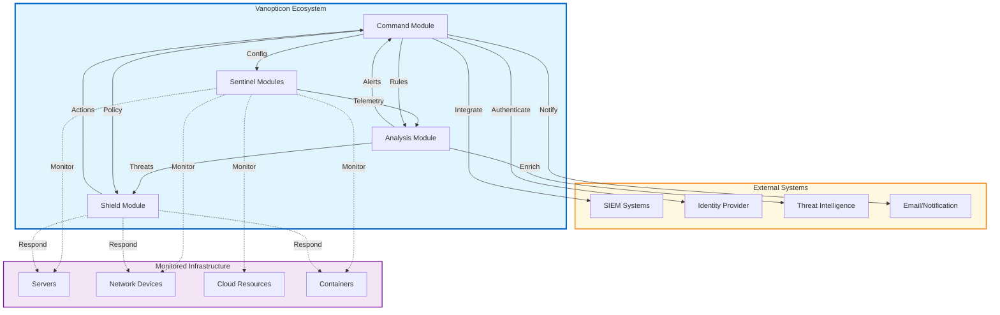

## Module Architecture

### Sentinel Module

The Sentinel module provides distributed monitoring and data collection capabilities.

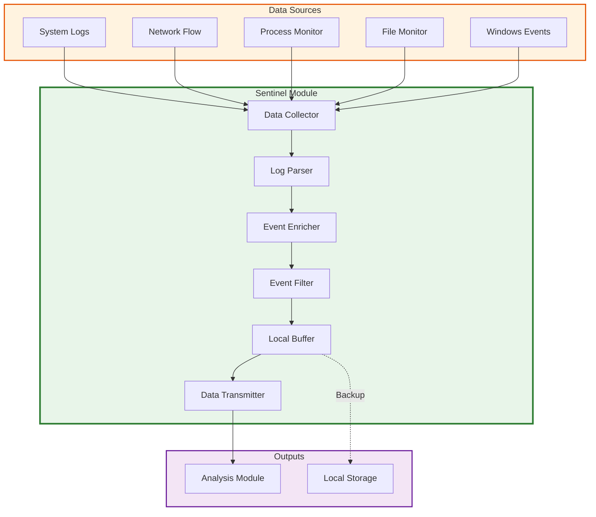

### Analysis Module

The Analysis module processes telemetry data using multiple detection techniques.

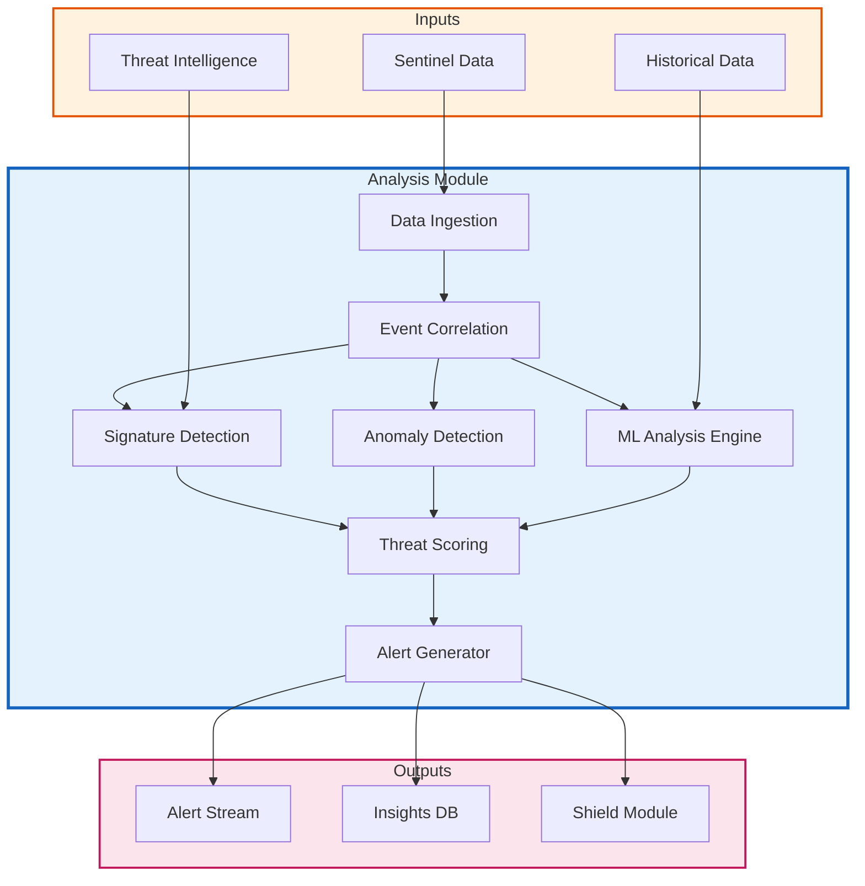

### Shield Module

The Shield module provides automated response and containment capabilities.

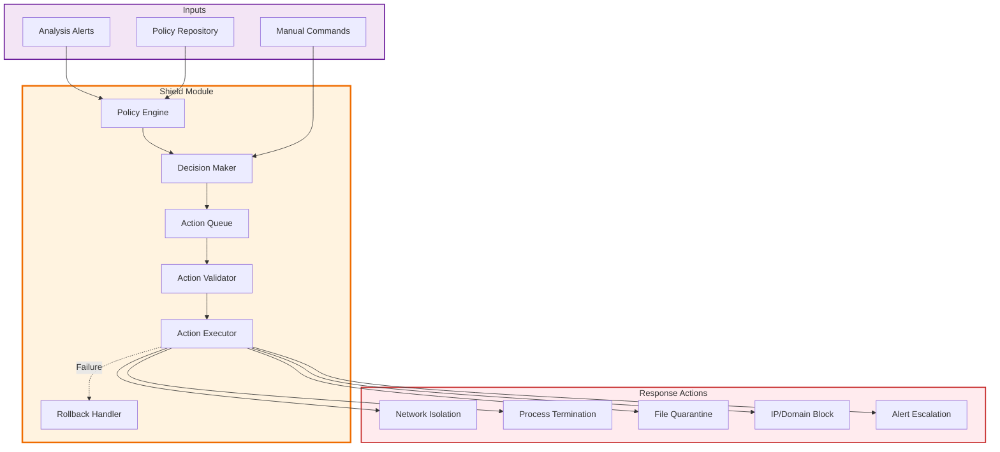

### Command Module

The Command module provides centralized coordination and control.

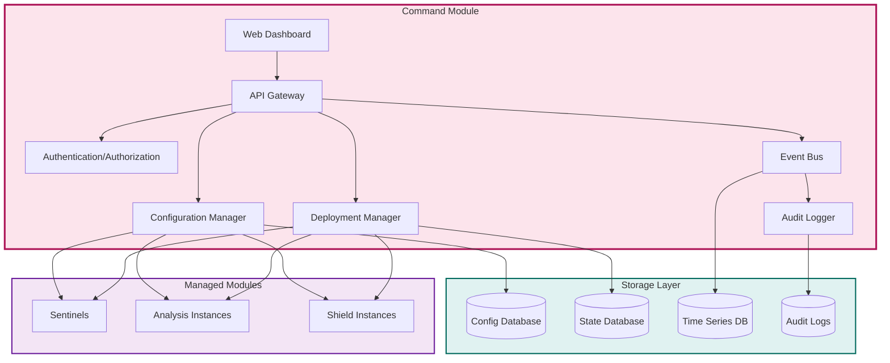

## Data Flow Architecture

### Telemetry Data Flow

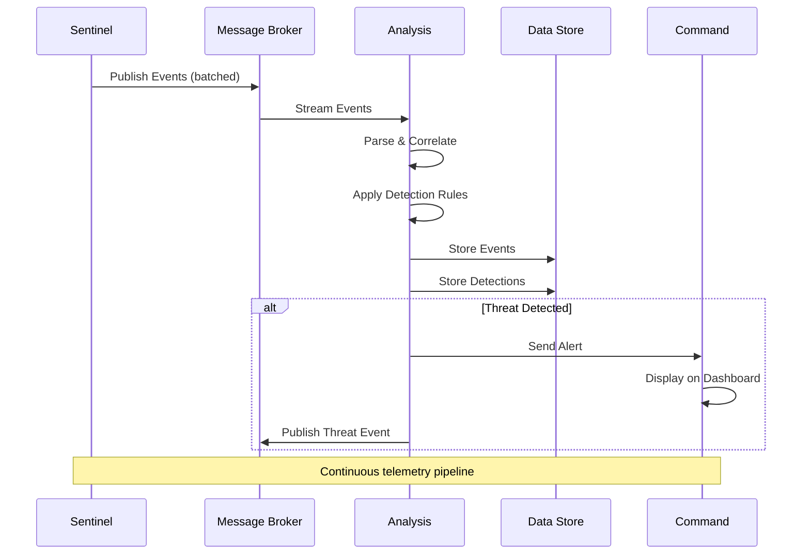

### Alert and Response Flow

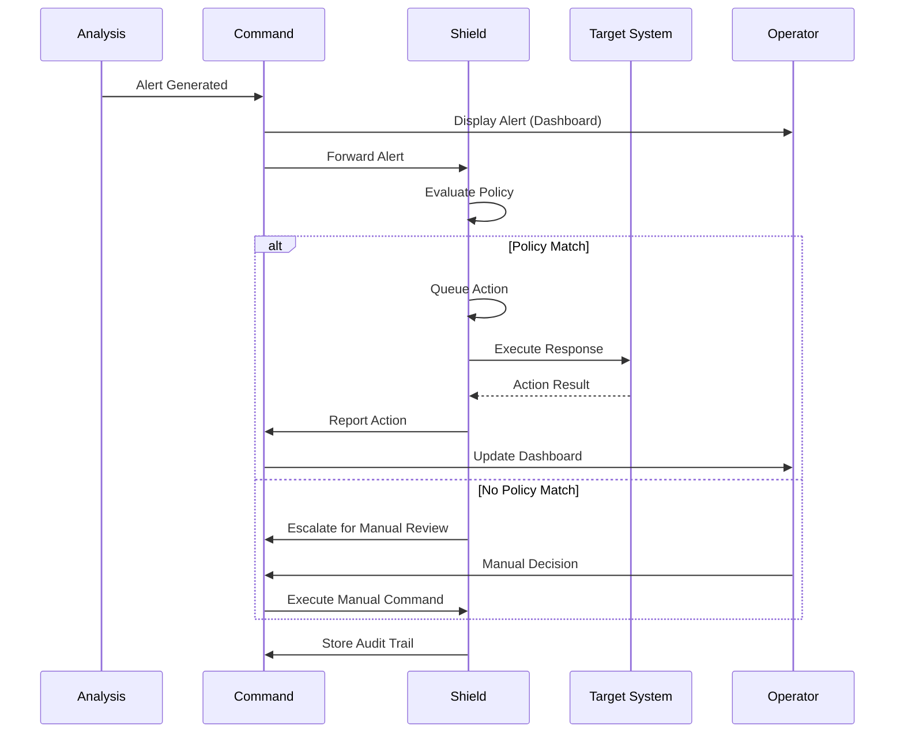

### Configuration Management Flow

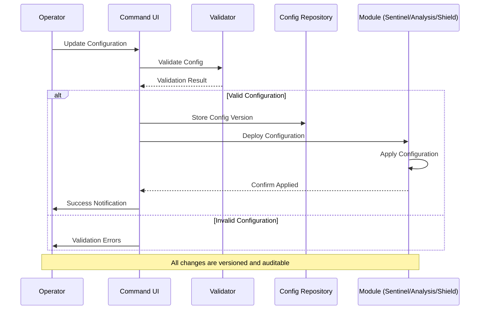

## Deployment Architecture

### Single-Host Deployment

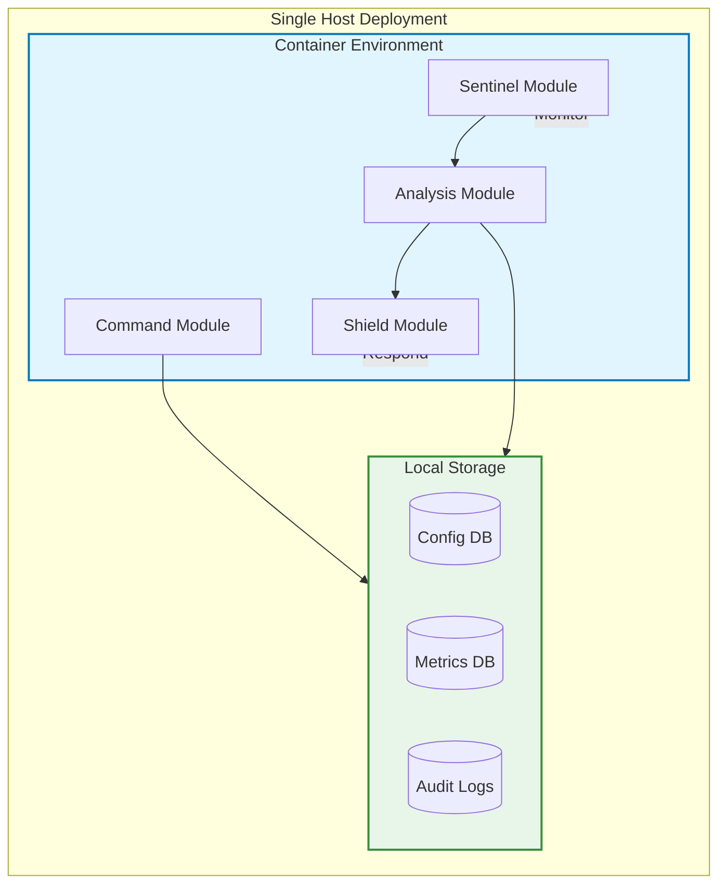

### Distributed Deployment

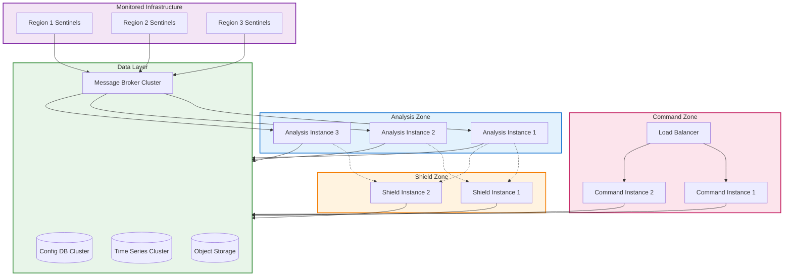

### Kubernetes Deployment

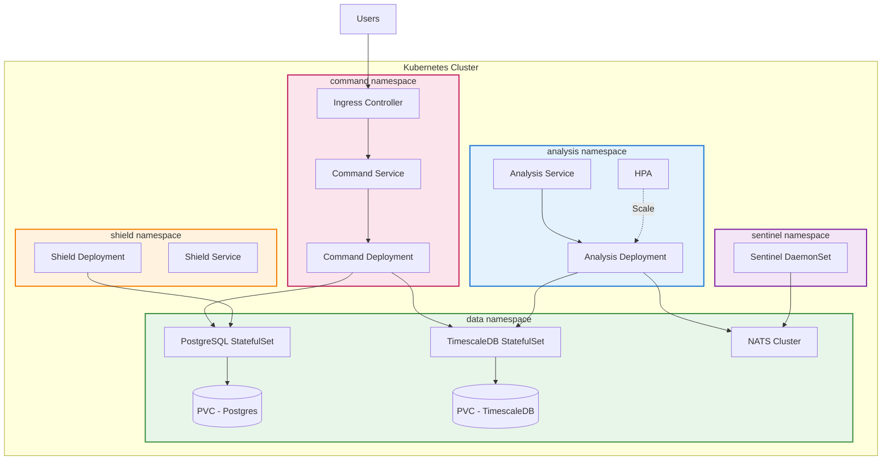

## Communication Patterns

### Synchronous Communication (Request-Response)

Used for:

- Configuration updates from Command to modules
- Health checks and status queries
- Manual operator commands
- API requests to Command module

Protocol: gRPC over HTTP/2 with TLS 1.3

### Asynchronous Communication (Publish-Subscribe)

Used for:

- Telemetry data from Sentinels to Analysis
- Alert distribution from Analysis to Shield and Command
- Event notifications across modules
- Real-time dashboard updates

Protocol: NATS or RabbitMQ with TLS

### Streaming Communication

Used for:

- Real-time dashboard data updates
- Log streaming for monitoring
- Live query results

Protocol: WebSocket over TLS

## Data Architecture

### Data Types and Storage

| Data Type | Volume | Latency Req | Retention | Storage |
|-----------|--------|-------------|-----------|---------|
| Raw Events | Very High | Low | 30-90 days | Time-series DB / Object Storage |
| Processed Events | High | Low | 1 year | Time-series DB |
| Alerts | Medium | Very Low | 2+ years | Relational DB |
| Configurations | Low | Low | Indefinite (versioned) | Relational DB |
| Audit Logs | Medium | Low | 7+ years | Append-only storage |
| ML Models | Low | Medium | Versioned | Object Storage |
| Dashboards | Low | Low | Indefinite | Relational DB |

### Data Lifecycle

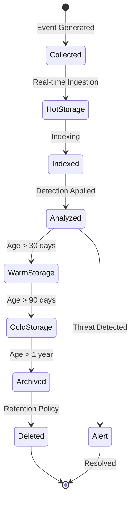

## Security Architecture

### Authentication Flow

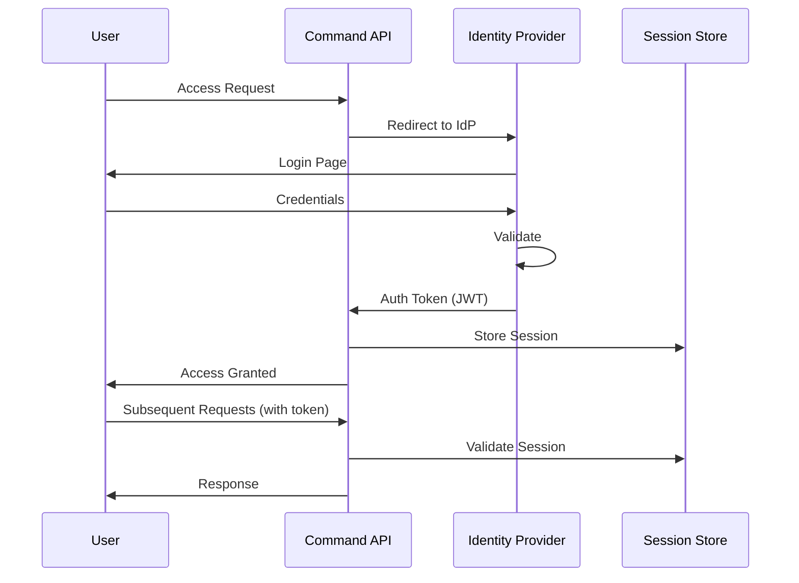

### Authorization Model

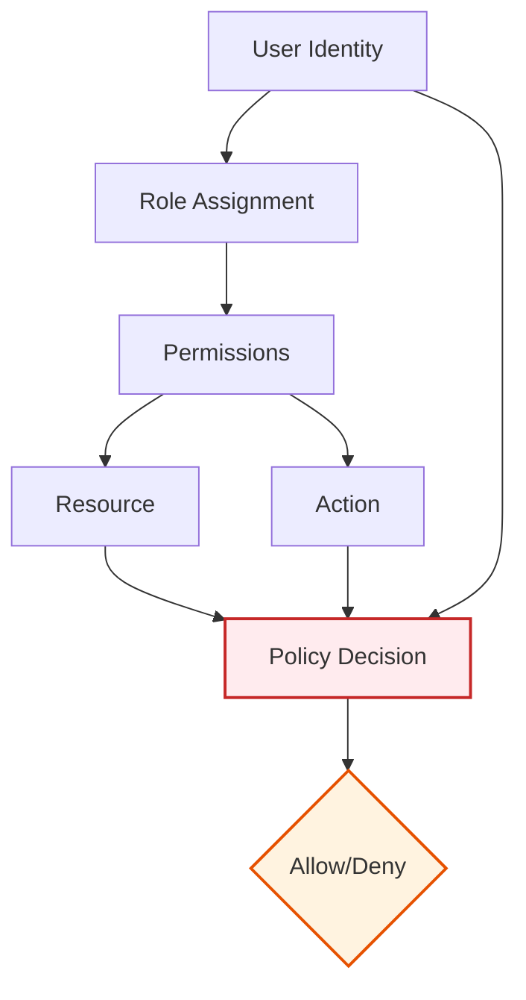

### Network Security Zones

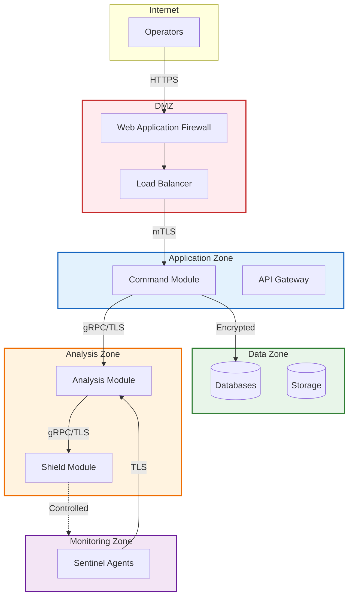

## Scalability Patterns

### Horizontal Scaling

All modules support horizontal scaling:

- **Sentinel**: Deployed as DaemonSet (one per monitored host) or StatefulSet for dedicated monitoring instances
- **Analysis**: Stateless processing nodes; scale based on event ingestion rate
- **Shield**: Stateless action executors; scale based on response volume
- **Command**: Active-active deployment behind load balancer; session affinity via distributed cache

### Vertical Scaling

Resource allocation recommendations per module:

- **Sentinel**: 256MB-512MB RAM, 0.5-1 CPU core per instance
- **Analysis**: 2-4GB RAM, 2-4 CPU cores per instance (scales with detection complexity)
- **Shield**: 512MB-1GB RAM, 1-2 CPU cores per instance
- **Command**: 1-2GB RAM, 1-2 CPU cores per instance

### Load Distribution

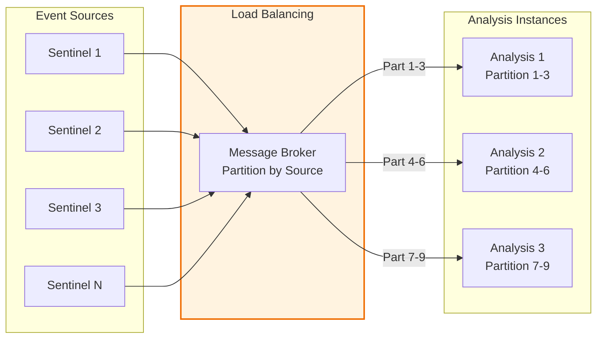

## Technology Stack

### Core Technologies

- **Language**: Rust (1.75+)
- **Async Runtime**: Tokio
- **Serialization**: Protocol Buffers, serde
- **API Framework**: tonic (gRPC), axum (REST)
- **Message Broker**: NATS or RabbitMQ
- **Databases**: PostgreSQL, TimescaleDB
- **Object Storage**: S3-compatible (MinIO, AWS S3)
- **Observability**: OpenTelemetry, Prometheus, Grafana

### Development Tools

- **Build**: Cargo
- **Formatting**: rustfmt
- **Linting**: clippy
- **Testing**: cargo test, cargo-nextest
- **Security**: cargo-audit, cargo-deny
- **Documentation**: rustdoc, mdBook

## Accessibility Considerations

All visual elements in the architecture conform to WCAG 2.2 AAA standards:

- **Color Contrast**: All color combinations in diagrams meet 7:1 contrast ratio
- **Color Independence**: Information is not conveyed by color alone; shapes and labels are used
- **Text Size**: All text in diagrams is readable at standard zoom levels
- **Alternative Text**: All diagrams are accompanied by textual descriptions
- **Keyboard Navigation**: Web UI supports full keyboard navigation
- **Screen Reader Support**: ARIA labels and semantic HTML used throughout

## References

- [Requirements Document](Requirements.md)
- [System Components](System-Components.md)
- [Security Architecture](Security-Architecture.md)
- [Deployment Guide](../deployment/README.md)
- [API Documentation](../api/README.md)
