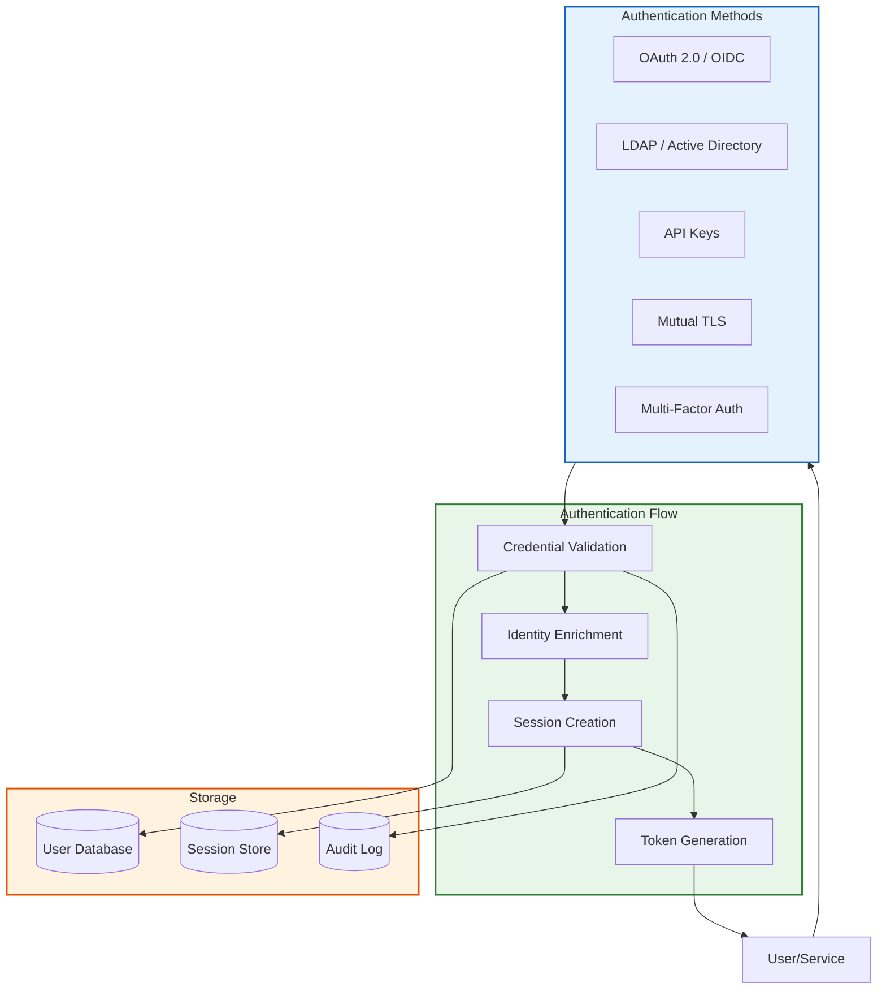
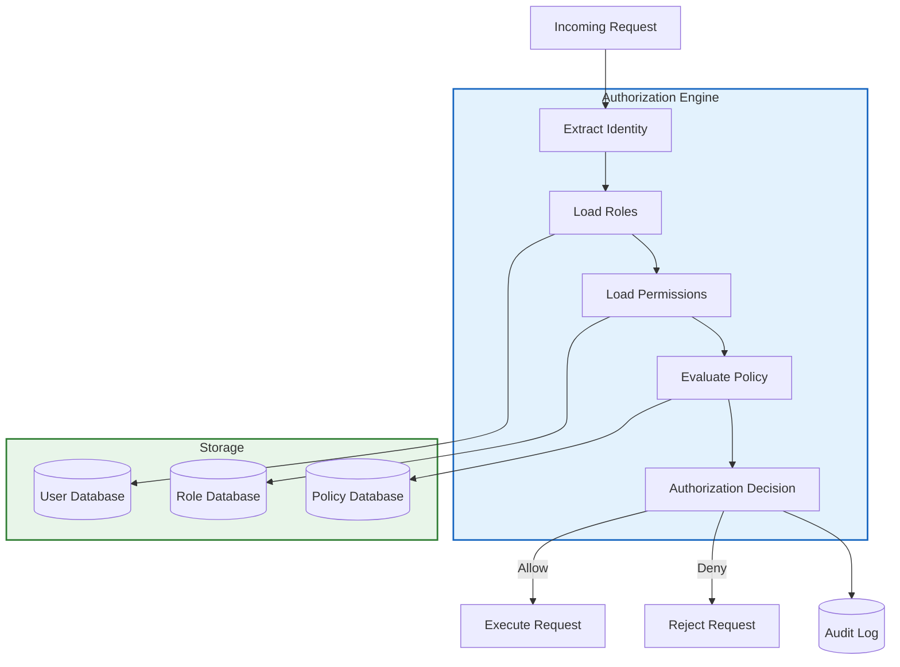
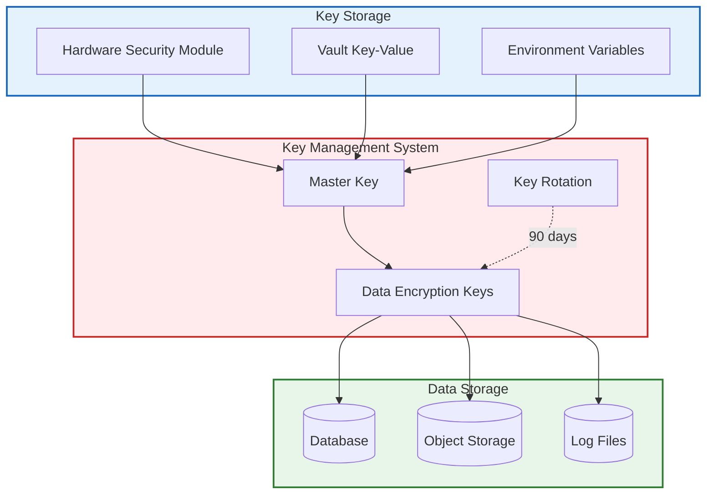
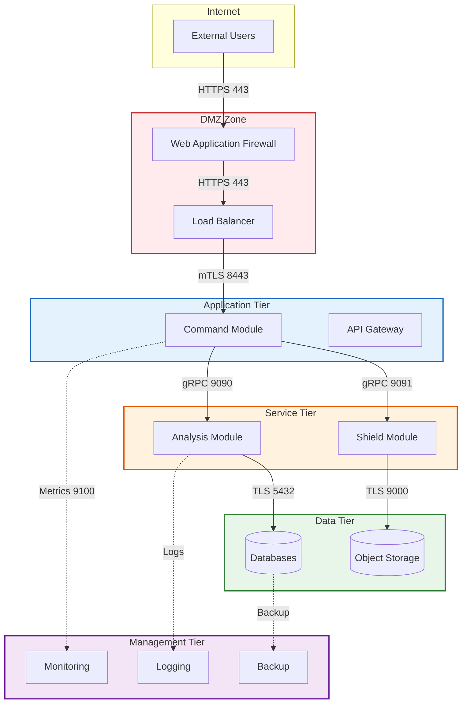
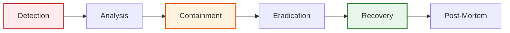

# Vanopticon Security Architecture

## Overview

Security is foundational to Vanopticon's design. As a cyber defense platform, Vanopticon must exemplify security best practices while protecting monitored infrastructure. This document details the security architecture, threat model, and security controls.

## Security Principles

### Defense in Depth

Multiple layers of security controls ensure that failure of any single control does not compromise the system.

### Principle of Least Privilege

Every component and user has only the minimum permissions necessary to perform their function.

### Zero Trust Architecture

No implicit trust is granted based on network location or component identity. All requests are authenticated and authorized.

### Secure by Default

Security features are enabled by default with secure configuration baselines.

### Cryptographic Integrity

All sensitive data is encrypted at rest and in transit. Cryptographic signatures ensure integrity.

## Threat Model

### Assets

**Critical Assets:**

- Collected telemetry data (contains security-sensitive information)
- Threat intelligence and detection rules
- Security policies and response procedures
- Authentication credentials and session tokens
- Audit logs and compliance data
- System configuration and secrets

**Asset Classification:**

| Asset Type | Confidentiality | Integrity | Availability | Retention |
|-----------|----------------|-----------|--------------|-----------|
| Telemetry Data | High | High | High | 30-90 days |
| Alerts | High | Critical | High | 2+ years |
| Policies | Medium | Critical | High | Indefinite |
| Audit Logs | High | Critical | Medium | 7+ years |
| Credentials | Critical | Critical | High | Per policy |
| Configuration | Medium | High | High | Versioned |

### Threat Actors

**External Attackers:**

- Capabilities: Advanced persistent threats (APT), organized cybercrime
- Motivations: Data theft, system disruption, ransomware
- Attack vectors: Network exploitation, phishing, supply chain

**Malicious Insiders:**

- Capabilities: Legitimate access, system knowledge
- Motivations: Data theft, sabotage, espionage
- Attack vectors: Privilege abuse, data exfiltration

**Accidental Insiders:**

- Capabilities: Legitimate access, limited security awareness
- Motivations: Unintentional errors
- Attack vectors: Misconfiguration, social engineering

### Threat Scenarios

#### TS-001: Sentinel Compromise

**Scenario**: Attacker gains control of Sentinel agent on monitored host.

**Impact**:

- Attacker can manipulate or suppress telemetry data
- Attacker can pivot to other monitored systems
- Attacker gains visibility into monitoring capabilities

**Mitigations**:

- Sentinel runs with minimal privileges
- Telemetry is cryptographically signed
- Analysis module detects anomalous Sentinel behavior
- Regular integrity checks of Sentinel binaries

#### TS-002: Analysis Module Attack

**Scenario**: Attacker exploits vulnerability in Analysis module to execute arbitrary code.

**Impact**:

- Complete visibility into all monitored activity
- Ability to suppress or forge alerts
- Potential lateral movement to other components

**Mitigations**:

- Rust memory safety (no unsafe code)
- Input validation and sanitization
- Network segmentation and firewalls
- Regular security audits and updates
- Intrusion detection on Analysis hosts

#### TS-003: Policy Manipulation

**Scenario**: Attacker modifies security policies to enable malicious actions or disable defenses.

**Impact**:

- Automated response disabled or misdirected
- Legitimate actions blocked (denial of service)
- Malicious actions authorized

**Mitigations**:

- Policy changes require authentication and authorization
- Policy versioning and audit trail
- Policy syntax validation before deployment
- Dry-run testing of policy changes
- Approval workflow for critical policies

#### TS-004: Credential Theft

**Scenario**: Attacker obtains authentication credentials for Vanopticon access.

**Impact**:

- Unauthorized access to security data
- Ability to modify configurations
- Suppression of alerts and responses

**Mitigations**:

- Multi-factor authentication (MFA) required
- Short-lived session tokens
- IP allowlisting for administrative access
- Credential rotation and expiration
- Anomaly detection on user behavior

#### TS-005: Data Exfiltration

**Scenario**: Attacker exfiltrates sensitive telemetry or alert data.

**Impact**:

- Exposure of security posture and vulnerabilities
- Privacy breach of monitored data
- Intelligence gathering for future attacks

**Mitigations**:

- Data encryption at rest and in transit
- Network segmentation and egress filtering
- Data access logging and monitoring
- Data loss prevention (DLP) controls
- Minimum data retention policies

#### TS-006: Denial of Service

**Scenario**: Attacker floods Vanopticon with malicious traffic or events to overwhelm system.

**Impact**:

- Loss of monitoring visibility
- Delayed threat detection and response
- Resource exhaustion

**Mitigations**:

- Rate limiting on all ingestion points
- Event filtering and sampling
- Horizontal scaling for resilience
- DDoS protection at network edge
- Resource quotas and circuit breakers

## Authentication and Authorization

### Authentication Methods



#### OAuth 2.0 / OpenID Connect

**Use Case**: Web dashboard authentication, third-party integrations

**Flow**: Authorization Code flow with PKCE

**Configuration**:

```yaml
oauth:
  providers:
    - name: corporate_idp
      issuer: https://idp.example.com
      client_id: vanopticon-prod
      client_secret_env: OAUTH_CLIENT_SECRET
      scopes:
        - openid
        - profile
        - email
      redirect_uri: https://vanopticon.example.com/auth/callback
      require_mfa: true
```

#### LDAP / Active Directory

**Use Case**: Enterprise integration, centralized user management

**Configuration**:

```yaml
ldap:
  servers:
    - url: ldaps://ldap.example.com:636
      bind_dn: CN=vanopticon,OU=Services,DC=example,DC=com
      bind_password_env: LDAP_BIND_PASSWORD
      base_dn: DC=example,DC=com
      user_filter: (&(objectClass=user)(sAMAccountName={username}))
      group_filter: (&(objectClass=group)(member={dn}))
  tls:
    verify_certificate: true
    ca_file: /etc/vanopticon/certs/ca.crt
```

#### API Keys

**Use Case**: Service-to-service authentication, automation

**Properties**:

- SHA-256 hashed in database
- Scoped to specific permissions
- Expiration dates enforced
- Rotation supported

**Format**: `vano_<environment>_<random_string>`

Example: `vano_prod_a3k9d8f7h2j4m6n8`

#### Mutual TLS (mTLS)

**Use Case**: Inter-module communication, Sentinel authentication

**Requirements**:

- Client certificate signed by Vanopticon CA
- Certificate attributes validated (CN, SAN)
- Certificate revocation list (CRL) checked
- Minimum TLS 1.3

### Authorization Model



#### Role-Based Access Control (RBAC)

**Predefined Roles**:

```yaml
roles:
  - name: administrator
    description: Full system access
    permissions:
      - "*:*:*"
  
  - name: analyst
    description: Security analyst
    permissions:
      - "alerts:read:*"
      - "alerts:update:*"
      - "alerts:comment:*"
      - "dashboards:read:*"
      - "assets:read:*"
  
  - name: responder
    description: Incident responder
    permissions:
      - "alerts:read:*"
      - "alerts:update:*"
      - "actions:execute:approved"
      - "shields:read:*"
  
  - name: viewer
    description: Read-only access
    permissions:
      - "alerts:read:*"
      - "dashboards:read:*"
      - "assets:read:*"
  
  - name: auditor
    description: Audit log access
    permissions:
      - "audit:read:*"
      - "reports:generate:*"
```

**Permission Format**: `<resource>:<action>:<scope>`

Examples:

- `alerts:read:*` - Read all alerts
- `alerts:update:own` - Update own alerts
- `policies:create:analysis` - Create Analysis policies
- `actions:execute:approved` - Execute pre-approved actions

#### Policy-Based Access Control (PBAC)

For fine-grained authorization beyond RBAC:

```yaml
policy:
  name: restrict_prod_policy_changes
  description: Restrict production policy changes to senior analysts
  effect: deny
  principals:
    roles:
      - analyst
  actions:
    - policies:update
    - policies:delete
  resources:
    environments:
      - production
  conditions:
    - attribute: user.tenure
      operator: lt
      value: 365  # days
```

#### Attribute-Based Access Control (ABAC)

Context-aware authorization using attributes:

```rust
pub struct AuthorizationContext {
    pub user: User,
    pub resource: Resource,
    pub action: Action,
    pub environment: Environment,
    pub time: DateTime<Utc>,
    pub ip_address: IpAddr,
    pub mfa_verified: bool,
}

pub fn authorize(ctx: &AuthorizationContext) -> AuthzDecision {
    // Check time-based restrictions
    if ctx.action.is_critical() && !is_business_hours(ctx.time) {
        return AuthzDecision::Deny("Critical actions only during business hours");
    }
    
    // Check IP restrictions
    if ctx.action.is_administrative() && !is_allowed_ip(ctx.ip_address) {
        return AuthzDecision::Deny("Administrative actions from approved IPs only");
    }
    
    // Check MFA for sensitive actions
    if ctx.action.is_sensitive() && !ctx.mfa_verified {
        return AuthzDecision::Deny("MFA required for sensitive actions");
    }
    
    // Delegate to policy engine
    evaluate_policies(ctx)
}
```

## Encryption

### Data in Transit

**Protocol**: TLS 1.3 (minimum)

**Cipher Suites** (in preference order):

1. TLS_AES_256_GCM_SHA384
2. TLS_CHACHA20_POLY1305_SHA256
3. TLS_AES_128_GCM_SHA256

**Certificate Management**:

```yaml
tls:
  certificates:
    server:
      cert_file: /etc/vanopticon/certs/server.crt
      key_file: /etc/vanopticon/certs/server.key
      # Support encrypted key files
      key_password_env: TLS_KEY_PASSWORD
    
    ca:
      # System CA bundle
      system_ca: true
      # Additional CAs
      ca_files:
        - /etc/vanopticon/certs/internal-ca.crt
    
    client:
      # For mTLS
      cert_file: /etc/vanopticon/certs/client.crt
      key_file: /etc/vanopticon/certs/client.key
  
  # Certificate rotation
  auto_reload: true
  reload_interval: 1h
  
  # Verification
  verify_peer: true
  verify_hostname: true
```

**Certificate Requirements**:

- Minimum 2048-bit RSA or 256-bit ECDSA
- Valid CA signature chain
- Appropriate Subject Alternative Names (SAN)
- Not expired or revoked

### Data at Rest

**Algorithm**: AES-256-GCM

**Key Management**:



**Key Hierarchy**:

1. **Master Key**: Stored in HSM or secure key management service
2. **Data Encryption Keys (DEK)**: Per-database, per-object, or per-log file
3. **Key Encryption Keys (KEK)**: Encrypt DEKs using master key

**Configuration**:

```yaml
encryption:
  enabled: true
  algorithm: aes-256-gcm
  
  key_management:
    provider: vault  # or hsm, kms, env
    config:
      address: https://vault.example.com:8200
      auth_method: kubernetes
      mount_path: vanopticon/encryption
      key_name: master-key
  
  # What to encrypt
  targets:
    - database: postgresql
      tables:
        - events
        - alerts
        - users
      columns:
        - sensitive_data
        - credentials
    
    - object_storage: s3
      buckets:
        - vanopticon-telemetry
        - vanopticon-backups
    
    - logs: file
      paths:
        - /var/log/vanopticon/*.log
  
  key_rotation:
    enabled: true
    interval: 90d
    automatic: true
```

### Secret Management

**Supported Backends**:

- HashiCorp Vault
- AWS Secrets Manager
- Azure Key Vault
- Kubernetes Secrets (encrypted at rest)
- Environment variables (development only)

**Secret Types**:

- Database credentials
- API keys
- TLS private keys
- OAuth client secrets
- Encryption keys

**Secret Rotation**:

```rust
pub struct SecretRotation {
    pub secret_name: String,
    pub current_version: u32,
    pub next_version: Option<u32>,
    pub rotation_strategy: RotationStrategy,
}

pub enum RotationStrategy {
    // Deploy new secret, test, retire old
    BlueGreen {
        overlap_duration: Duration,
    },
    // Generate new secret immediately
    Immediate,
    // Schedule rotation
    Scheduled {
        rotation_time: DateTime<Utc>,
    },
}
```

## Network Security

### Network Segmentation



### Firewall Rules

**Ingress Rules**:

| Source | Destination | Port | Protocol | Purpose |
|--------|-------------|------|----------|---------|
| Internet | WAF | 443 | TCP/HTTPS | User access |
| WAF | Load Balancer | 443 | TCP/HTTPS | Backend routing |
| Load Balancer | Command | 8443 | TCP/mTLS | API access |
| Sentinels | Analysis | 9090 | TCP/gRPC | Telemetry |
| Analysis | Shield | 9091 | TCP/gRPC | Alerts |
| Management | All | 22 | TCP/SSH | Admin access |

**Egress Rules**:

| Source | Destination | Port | Protocol | Purpose |
|--------|-------------|------|----------|---------|
| Analysis | Internet | 443 | TCP/HTTPS | Threat intel |
| Command | IdP | 443 | TCP/HTTPS | Authentication |
| All | DNS | 53 | UDP/TCP | Name resolution |
| All | NTP | 123 | UDP | Time sync |

**Default Policy**: Deny all (allowlist approach)

### Intrusion Detection

**Host-Based IDS**:

- Monitor process execution
- Detect file integrity changes
- Track network connections
- Alert on suspicious patterns

**Network-Based IDS**:

- Deep packet inspection
- Protocol anomaly detection
- Threat signature matching
- Behavioral analysis

**Integration**: Vanopticon monitors its own infrastructure using Sentinel agents.

## Audit and Compliance

### Audit Logging

**Logged Events**:

- User authentication (success/failure)
- Authorization decisions (allow/deny)
- Configuration changes
- Policy modifications
- Alert creation and updates
- Response actions executed
- Data access (read/write/delete)
- Administrative operations

**Audit Log Format**:

```json
{
  "version": "1.0",
  "id": "3fa85f64-5717-4562-b3fc-2c963f66afa6",
  "timestamp": "2025-01-15T10:30:00.000Z",
  "severity": "info",
  "category": "authentication",
  "actor": {
    "type": "user",
    "id": "user@example.com",
    "ip": "192.168.1.100",
    "user_agent": "Mozilla/5.0...",
    "session_id": "sess_abc123"
  },
  "action": {
    "type": "login",
    "method": "oauth",
    "mfa_used": true
  },
  "resource": {
    "type": "system",
    "id": "vanopticon-prod"
  },
  "outcome": {
    "status": "success",
    "duration_ms": 234
  },
  "context": {
    "environment": "production",
    "region": "us-east-1"
  }
}
```

**Tamper Evidence**:

```rust
pub struct AuditLogEntry {
    pub entry: serde_json::Value,
    pub sequence_number: u64,
    pub previous_hash: Hash,
    pub current_hash: Hash,
}

impl AuditLogEntry {
    pub fn new(entry: serde_json::Value, previous: &AuditLogEntry) -> Self {
        let sequence_number = previous.sequence_number + 1;
        let previous_hash = previous.current_hash.clone();
        
        let mut hasher = Sha256::new();
        hasher.update(sequence_number.to_le_bytes());
        hasher.update(&previous_hash);
        hasher.update(entry.to_string().as_bytes());
        let current_hash = Hash::from(hasher.finalize());
        
        Self {
            entry,
            sequence_number,
            previous_hash,
            current_hash,
        }
    }
    
    pub fn verify(&self, previous: &AuditLogEntry) -> bool {
        // Verify chain integrity
        if self.sequence_number != previous.sequence_number + 1 {
            return false;
        }
        
        if self.previous_hash != previous.current_hash {
            return false;
        }
        
        // Recompute hash
        let mut hasher = Sha256::new();
        hasher.update(self.sequence_number.to_le_bytes());
        hasher.update(&self.previous_hash);
        hasher.update(self.entry.to_string().as_bytes());
        let computed_hash = Hash::from(hasher.finalize());
        
        self.current_hash == computed_hash
    }
}
```

### Compliance Frameworks

#### GDPR Compliance

**Personal Data Handling**:

- Data minimization: Only collect necessary data
- Purpose limitation: Use data only for security purposes
- Consent management: User consent for optional data collection
- Right to access: Users can request their data
- Right to erasure: Users can request data deletion
- Data portability: Export data in standard formats
- Privacy by design: Built-in privacy protections

**Technical Controls**:

```yaml
gdpr:
  personal_data:
    types:
      - user_accounts
      - authentication_logs
      - ip_addresses
    
  data_subject_rights:
    access:
      enabled: true
      response_time: 30d
    
    erasure:
      enabled: true
      response_time: 30d
      exclusions:
        - audit_logs  # Legal hold
        - security_incidents  # Legitimate interest
    
    portability:
      enabled: true
      formats:
        - json
        - csv
  
  consent:
    required_for:
      - telemetry_collection
      - threat_intelligence_sharing
    
  data_protection:
    encryption: required
    anonymization: enabled
    pseudonymization: enabled
```

#### SOC 2 Compliance

**Control Categories**:

1. **Security**: System protection against unauthorized access
2. **Availability**: System availability for operation
3. **Processing Integrity**: Complete, accurate, timely processing
4. **Confidentiality**: Confidential information protection
5. **Privacy**: Personal information collection, use, retention, disclosure

**Implemented Controls**:

- Access controls (RBAC, MFA)
- Encryption (transit and rest)
- Logging and monitoring
- Incident response procedures
- Change management
- Vendor management
- Business continuity planning

#### HIPAA Compliance

**Applicability**: When monitoring healthcare systems containing PHI.

**Technical Safeguards**:

- Access controls (unique user identification, automatic logoff)
- Audit controls (comprehensive logging)
- Integrity controls (tamper-evident logs)
- Transmission security (encryption)

**Administrative Safeguards**:

- Security management process
- Workforce security policies
- Information access management
- Security awareness training

#### PCI DSS

**Applicability**: When monitoring payment card processing systems.

**Requirements**:

1. Install and maintain firewall configuration
2. Do not use vendor-supplied defaults
3. Protect stored cardholder data
4. Encrypt transmission of cardholder data
5. Use and regularly update anti-virus
6. Develop and maintain secure systems
7. Restrict access by business need-to-know
8. Assign unique ID to each person
9. Restrict physical access
10. Track and monitor network access
11. Regularly test security systems
12. Maintain information security policy

## Security Operations

### Vulnerability Management

**Process**:

1. **Discovery**: Continuous scanning for vulnerabilities
2. **Assessment**: Evaluate severity and exploitability
3. **Prioritization**: Risk-based prioritization
4. **Remediation**: Patching and mitigation
5. **Verification**: Validate fixes

**Tools**:

- `cargo audit`: Rust dependency scanning
- `cargo deny`: License and security policy enforcement
- OWASP Dependency-Check
- Trivy: Container image scanning
- Automated security testing in CI/CD

**SLA**:

- Critical: 24 hours
- High: 7 days
- Medium: 30 days
- Low: 90 days

### Incident Response

**Phases**:



**Incident Classification**:

- **P0 (Critical)**: Active exploitation, data breach
- **P1 (High)**: Confirmed vulnerability, potential breach
- **P2 (Medium)**: Security misconfiguration, policy violation
- **P3 (Low)**: Security observation, information gathering

**Response Team**:

- Incident Commander
- Security Engineers
- System Administrators
- Communications Lead
- Legal/Compliance (as needed)

### Security Monitoring

**What We Monitor**:

- Failed authentication attempts
- Authorization failures
- Configuration changes
- Unusual API access patterns
- Privilege escalations
- Data access anomalies
- Resource usage spikes
- Certificate expiration
- Security scan results

**Alert Thresholds**:

```yaml
security_monitoring:
  alerts:
    - name: repeated_auth_failures
      condition: auth_failures > 5 in 5m
      severity: high
      action: block_ip
    
    - name: unusual_data_access
      condition: data_access_volume > baseline * 3
      severity: medium
      action: alert_soc
    
    - name: configuration_change
      condition: config_changed AND user NOT IN admins
      severity: high
      action: alert_and_rollback
    
    - name: certificate_expiring
      condition: cert_expires_in < 30d
      severity: medium
      action: alert_admins
```

### Penetration Testing

**Frequency**: Annually and after major changes

**Scope**:

- External network perimeter
- Web application (Command UI)
- API endpoints
- Authentication and authorization
- Inter-component communication
- Cloud infrastructure

**Methodology**:

- OWASP Testing Guide
- NIST SP 800-115
- PTES (Penetration Testing Execution Standard)

## Security Best Practices

### Secure Development Lifecycle

1. **Requirements**: Security requirements defined
2. **Design**: Threat modeling conducted
3. **Implementation**: Secure coding guidelines followed
4. **Testing**: Security testing performed
5. **Deployment**: Secure configuration baseline
6. **Maintenance**: Security updates applied

### Code Security

**Rust Safety**:

```toml
[lints.rust]
unsafe_code = "forbid"
```

**Dependency Management**:

```bash
# Check for known vulnerabilities
cargo audit

# Enforce security policies
cargo deny check

# Keep dependencies updated
cargo update
```

**Static Analysis**:

```bash
# Linting
cargo clippy -- -D warnings

# Format checking
cargo fmt --check

# Security-focused clippy
cargo clippy --all-targets -- -D clippy::all -D clippy::pedantic
```

### Secrets in Code

**Never**:

- Commit secrets to version control
- Hardcode credentials in source
- Log sensitive information
- Include secrets in error messages

**Always**:

- Use environment variables or secret management
- Rotate secrets regularly
- Use minimum privilege credentials
- Scan for accidentally committed secrets

### Supply Chain Security

**Verification**:

- Verify dependency signatures
- Pin dependency versions
- Audit dependency licenses
- Monitor for dependency vulnerabilities

**Build Security**:

- Reproducible builds
- Signed artifacts
- Provenance tracking
- SBOM (Software Bill of Materials)

## References

- [Architecture Overview](Architecture.md)
- [System Components](System-Components.md)
- [Deployment Architecture](Deployment-Architecture.md)
- OWASP Application Security Verification Standard (ASVS)
- NIST Cybersecurity Framework
- CIS Controls
