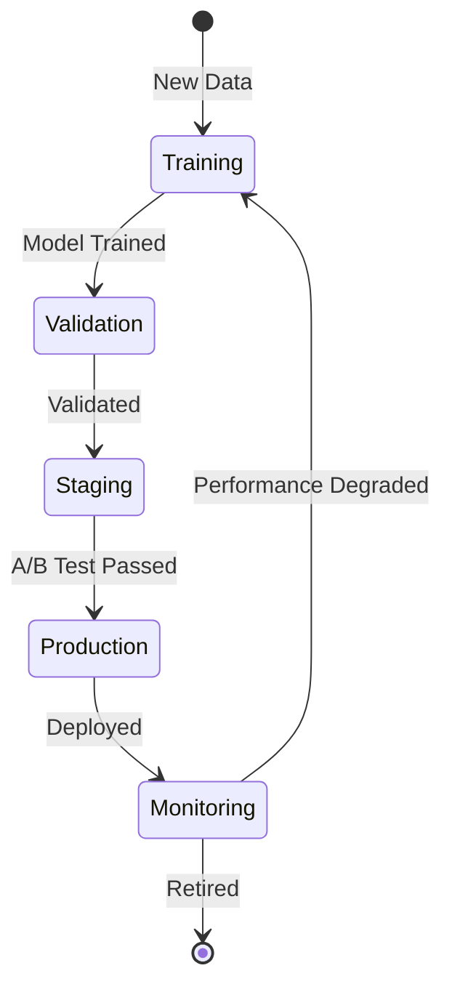

# Vanopticon System Components

## Overview

This document provides detailed specifications for each component within the Vanopticon architecture. Each component is designed to be modular, independently deployable, and scalable.

## Sentinel Module Components

### Data Collector

**Purpose**: Gather raw telemetry data from various sources on monitored systems.

**Responsibilities**:

- Monitor system logs (syslog, Windows Event Log)
- Capture network traffic metadata (NetFlow, packet headers)
- Track process lifecycle events (creation, termination)
- Monitor file system changes (creation, modification, deletion)
- Collect performance metrics (CPU, memory, disk, network)
- Gather security events (authentication, authorization)

**Interfaces**:

- **Input**: Operating system APIs, log files, network interfaces
- **Output**: Raw event stream to Parser

**Configuration**:

```yaml
collector:
  sources:
    - type: syslog
      path: /var/log/syslog
      format: rfc5424
    - type: netflow
      listen: 0.0.0.0:2055
      version: v9
    - type: process_monitor
      enabled: true
      include_cmdline: true
    - type: file_monitor
      paths:
        - /etc
        - /var/www
      recursive: true
  batch_size: 1000
  flush_interval: 5s
```

**Performance Requirements**:

- Collect minimum 10,000 events per second
- Memory usage: < 200MB
- CPU usage: < 3% average

### Log Parser

**Purpose**: Parse and normalize raw events into structured format.

**Responsibilities**:

- Parse various log formats (JSON, syslog, CEF, LEEF)
- Extract key fields (timestamp, source, severity, message)
- Normalize field names across different sources
- Handle parsing errors gracefully
- Validate data types

**Interfaces**:

- **Input**: Raw event stream from Collector
- **Output**: Structured events to Enricher

**Data Model**:

```rust
pub struct Event {
    pub id: Uuid,
    pub timestamp: DateTime<Utc>,
    pub source_host: String,
    pub source_ip: Option<IpAddr>,
    pub event_type: EventType,
    pub severity: Severity,
    pub category: Category,
    pub message: String,
    pub fields: HashMap<String, Value>,
}
```

**Performance Requirements**:

- Parse 15,000 events per second
- Parsing latency: < 1ms per event
- Error rate: < 0.1%

### Event Enricher

**Purpose**: Augment events with additional context and metadata.

**Responsibilities**:

- Add host metadata (hostname, OS, version)
- Resolve IP addresses to hostnames
- Add geographical information for external IPs
- Append tags based on host inventory
- Enrich with threat intelligence indicators
- Add correlation IDs for related events

**Interfaces**:

- **Input**: Structured events from Parser
- **Output**: Enriched events to Filter
- **External**: DNS resolver, GeoIP database, threat intelligence feeds

**Configuration**:

```yaml
enricher:
  host_metadata:
    enabled: true
    cache_ttl: 1h
  dns_resolution:
    enabled: true
    timeout: 2s
  geoip:
    enabled: true
    database: /var/lib/vanopticon/GeoLite2-City.mmdb
  threat_intelligence:
    enabled: true
    feeds:
      - url: https://example.com/ioc-feed
        refresh: 1h
```

**Performance Requirements**:

- Enrich 10,000 events per second
- Enrichment latency: < 5ms per event
- Cache hit rate: > 90%

### Event Filter

**Purpose**: Filter events based on configured rules to reduce noise.

**Responsibilities**:

- Apply inclusion filters (whitelist specific events)
- Apply exclusion filters (blacklist known benign events)
- Rate limit high-frequency events
- Deduplicate identical events
- Sampling for high-volume event types

**Interfaces**:

- **Input**: Enriched events from Enricher
- **Output**: Filtered events to Buffer

**Configuration**:

```yaml
filter:
  rules:
    - name: exclude_info_logs
      action: drop
      condition: severity == "info" AND source_type == "application"
    - name: rate_limit_failed_ssh
      action: rate_limit
      condition: event_type == "auth_failed" AND service == "ssh"
      rate: 10/minute
    - name: sample_dns_queries
      action: sample
      condition: event_type == "dns_query"
      sample_rate: 0.1
```

**Performance Requirements**:

- Filter 15,000 events per second
- Filter latency: < 0.5ms per event
- Rule evaluation: < 100 rules per event

### Local Buffer

**Purpose**: Provide resilient temporary storage for events during network disruptions.

**Responsibilities**:

- Buffer events when transmitter is unavailable
- Persist buffer to disk for durability
- Implement back-pressure when buffer is full
- Replay buffered events when connectivity restored
- Monitor buffer health and capacity

**Interfaces**:

- **Input**: Filtered events from Filter
- **Output**: Buffered events to Transmitter
- **Storage**: Local disk (configurable location)

**Configuration**:

```yaml
buffer:
  type: disk
  path: /var/lib/vanopticon/buffer
  max_size: 10GB
  max_age: 24h
  compression: zstd
  back_pressure:
    high_watermark: 80%
    low_watermark: 50%
```

**Performance Requirements**:

- Write throughput: 20,000 events per second
- Storage efficiency: > 5:1 compression ratio
- Recovery time: < 30 seconds after restart

### Data Transmitter

**Purpose**: Reliably transmit events to Analysis module.

**Responsibilities**:

- Batch events for efficient transmission
- Compress batches to reduce bandwidth
- Implement retry logic with exponential backoff
- Monitor transmission health
- Support multiple protocols (gRPC, HTTP, NATS)
- Maintain delivery guarantees (at-least-once)

**Interfaces**:

- **Input**: Buffered events from Buffer
- **Output**: Event stream to Analysis module
- **Protocol**: gRPC streaming or NATS pub-sub

**Configuration**:

```yaml
transmitter:
  protocol: grpc
  endpoints:
    - address: analysis-1.vanopticon.local:9090
      weight: 1
    - address: analysis-2.vanopticon.local:9090
      weight: 1
  batch:
    size: 1000
    timeout: 5s
  compression: zstd
  retry:
    initial_backoff: 1s
    max_backoff: 60s
    max_attempts: 10
  tls:
    enabled: true
    cert_file: /etc/vanopticon/certs/sentinel.crt
    key_file: /etc/vanopticon/certs/sentinel.key
    ca_file: /etc/vanopticon/certs/ca.crt
```

**Performance Requirements**:

- Transmit 15,000 events per second
- Batch compression: > 10:1 ratio
- Network efficiency: > 90% utilization
- Reconnection time: < 5 seconds

## Analysis Module Components

### Data Ingestion

**Purpose**: Receive and validate incoming telemetry data from Sentinels.

**Responsibilities**:

- Accept gRPC/NATS streams from Sentinels
- Validate event schema and data integrity
- Decompress incoming batches
- Distribute events to processing pipeline
- Track ingestion metrics
- Handle backpressure from downstream components

**Interfaces**:

- **Input**: Event streams from Sentinels (gRPC, NATS)
- **Output**: Validated events to Correlation engine

**Data Validation**:

```rust
pub fn validate_event(event: &Event) -> Result<(), ValidationError> {
    // Required fields validation
    if event.timestamp.is_none() {
        return Err(ValidationError::MissingField("timestamp"));
    }
    
    // Timestamp recency check (reject events older than 7 days)
    let age = Utc::now() - event.timestamp;
    if age > Duration::days(7) {
        return Err(ValidationError::StaleEvent);
    }
    
    // Field type validation
    validate_field_types(&event.fields)?;
    
    Ok(())
}
```

**Performance Requirements**:

- Ingest 100,000 events per second per instance
- Validation latency: < 0.5ms per event
- Queue depth: < 10,000 events

### Event Correlation

**Purpose**: Correlate related events across time and sources to build attack chains.

**Responsibilities**:

- Group related events by correlation keys
- Maintain temporal windows for correlation
- Build event sequences and chains
- Identify multi-stage attacks
- Generate correlation IDs for linked events

**Interfaces**:

- **Input**: Validated events from Ingestion
- **Output**: Correlated event groups to detection engines
- **State**: Time-windowed correlation state

**Correlation Rules**:

```yaml
correlation:
  rules:
    - name: brute_force_attack
      description: Multiple failed logins followed by success
      window: 5m
      events:
        - type: auth_failed
          min_count: 5
          fields:
            - username
            - source_ip
        - type: auth_success
          fields:
            - username
            - source_ip
      correlation_keys:
        - username
        - source_ip
      severity: high
```

**Performance Requirements**:

- Correlate 50,000 events per second
- Correlation windows: up to 1 hour
- Memory per window: < 1GB
- State cleanup: automatic expiration

### Signature Detection

**Purpose**: Detect known threats using signature-based rules.

**Responsibilities**:

- Match events against signature database
- Support multiple rule formats (Sigma, YARA-like)
- Maintain rule version and metadata
- Track rule performance and efficacy
- Generate detections with confidence scores

**Interfaces**:

- **Input**: Correlated events from Correlation engine
- **Output**: Signature-based detections to Threat Scoring
- **Configuration**: Rule repository

**Rule Format (Sigma-like)**:

```yaml
title: Suspicious PowerShell Execution
id: 8f42b770-e1d1-4c7d-a8ac-3e58e95f9b5e
status: production
description: Detects suspicious PowerShell execution patterns
references:
  - https://attack.mitre.org/techniques/T1059/001/
author: Vanopticon Team
date: 2025/01/15
logsource:
  category: process_creation
  product: windows
detection:
  selection:
    Image|endswith: '\powershell.exe'
    CommandLine|contains:
      - '-EncodedCommand'
      - '-enc'
      - 'bypass'
      - 'hidden'
  condition: selection
falsepositives:
  - Administrative scripts
level: high
tags:
  - attack.execution
  - attack.t1059.001
```

**Performance Requirements**:

- Evaluate 50,000 events per second
- Rule count: support 10,000+ rules
- Rule evaluation: < 10ms per event
- False positive rate: < 2%

### Anomaly Detection

**Purpose**: Identify unusual patterns and behaviors using statistical and ML techniques.

**Responsibilities**:

- Build behavioral baselines per entity
- Detect statistical outliers
- Identify unusual access patterns
- Track entity behavior over time
- Generate anomaly scores and explanations

**Interfaces**:

- **Input**: Correlated events from Correlation engine
- **Output**: Anomaly detections to Threat Scoring
- **Storage**: Baseline models and historical data

**Detection Techniques**:

1. **Statistical Anomalies**: Z-score, IQR, percentile-based
2. **Time-Series Anomalies**: Seasonal decomposition, ARIMA-based
3. **Clustering**: DBSCAN, Isolation Forest
4. **Behavioral**: Markov chains, sequence analysis

**Configuration**:

```yaml
anomaly_detection:
  baseline:
    learning_period: 7d
    update_interval: 1h
    min_samples: 1000
  detectors:
    - name: unusual_login_time
      type: time_series
      entity: user
      metric: login_hour
      sensitivity: high
      threshold: 3_sigma
    - name: unusual_data_volume
      type: statistical
      entity: host
      metric: bytes_sent
      sensitivity: medium
      threshold: 95_percentile
```

**Performance Requirements**:

- Analyze 20,000 events per second
- Model training: daily batch updates
- Prediction latency: < 50ms
- Memory per model: < 100MB

### ML Analysis Engine

**Purpose**: Apply machine learning models for advanced threat detection.

**Responsibilities**:

- Load and manage ML models
- Feature extraction from events
- Model inference for threat classification
- Model versioning and A/B testing
- Performance monitoring and retraining triggers

**Interfaces**:

- **Input**: Correlated events from Correlation engine
- **Output**: ML-based detections to Threat Scoring
- **Storage**: Model repository

**Supported Models**:

- Random Forest (threat classification)
- Gradient Boosting (severity prediction)
- Neural Networks (sequence analysis)
- Transformer models (log analysis)

**Model Lifecycle**:



**Performance Requirements**:

- Inference: 10,000 predictions per second
- Inference latency: < 100ms
- Model size: < 1GB
- Concurrent models: 10+

### Threat Scoring

**Purpose**: Combine detection signals into unified threat scores.

**Responsibilities**:

- Aggregate scores from multiple detectors
- Weight scores by confidence and severity
- Calculate overall threat risk
- Generate threat priority ranking
- Provide score explanations

**Interfaces**:

- **Input**: Detections from Signature, Anomaly, and ML engines
- **Output**: Scored threats to Alert Generator

**Scoring Algorithm**:

```rust
pub fn calculate_threat_score(detections: &[Detection]) -> ThreatScore {
    let mut base_score = 0.0;
    let mut confidence_weight = 0.0;
    
    for detection in detections {
        let weight = match detection.source {
            DetectionSource::Signature => 1.0,
            DetectionSource::Anomaly => 0.7,
            DetectionSource::ML => 0.8,
        };
        
        base_score += detection.severity.numeric_value() * weight;
        confidence_weight += detection.confidence * weight;
    }
    
    let normalized_score = (base_score / detections.len() as f64).min(100.0);
    let final_score = normalized_score * (confidence_weight / detections.len() as f64);
    
    ThreatScore {
        score: final_score,
        severity: Severity::from_score(final_score),
        confidence: confidence_weight / detections.len() as f64,
        contributing_detections: detections.len(),
    }
}
```

**Score Ranges**:

- 0-20: Low (informational)
- 21-40: Medium (investigate)
- 41-70: High (respond)
- 71-100: Critical (immediate action)

**Performance Requirements**:

- Score 50,000 threats per second
- Scoring latency: < 1ms
- Explanation generation: < 5ms

### Alert Generator

**Purpose**: Generate actionable alerts from scored threats.

**Responsibilities**:

- Create alerts from high-scoring threats
- Deduplicate similar alerts
- Enrich alerts with context and recommendations
- Route alerts to appropriate destinations
- Track alert lifecycle (created, acknowledged, resolved)

**Interfaces**:

- **Input**: Scored threats from Threat Scoring
- **Output**: Alerts to Command module and Shield module
- **Storage**: Alert database

**Alert Structure**:

```rust
pub struct Alert {
    pub id: Uuid,
    pub timestamp: DateTime<Utc>,
    pub severity: Severity,
    pub confidence: f64,
    pub title: String,
    pub description: String,
    pub affected_assets: Vec<Asset>,
    pub threat_indicators: Vec<Indicator>,
    pub recommendations: Vec<String>,
    pub evidence: Vec<Event>,
    pub status: AlertStatus,
    pub assignee: Option<UserId>,
    pub tags: Vec<String>,
}
```

**Performance Requirements**:

- Generate 5,000 alerts per second
- Deduplication: < 5ms per alert
- Alert enrichment: < 10ms per alert

## Shield Module Components

### Policy Engine

**Purpose**: Evaluate security policies against incoming alerts.

**Responsibilities**:

- Load and parse policy definitions
- Evaluate policy conditions against alert context
- Support complex policy logic (AND, OR, NOT)
- Track policy matches and misses
- Validate policy syntax

**Interfaces**:

- **Input**: Alerts from Analysis module, Policies from repository
- **Output**: Matched policies to Decision Maker

**Policy Format**:

```yaml
policy:
  name: isolate_ransomware
  version: 1.0
  enabled: true
  priority: 100
  conditions:
    all:
      - field: alert.tags
        contains: ransomware
      - field: alert.severity
        gte: high
      - field: asset.type
        equals: server
  actions:
    - type: network_isolate
      parameters:
        allow_management: true
    - type: alert_escalate
      parameters:
        channels:
          - email
          - pagerduty
    - type: create_ticket
      parameters:
        system: jira
        priority: critical
  require_approval: false
  rollback_on_failure: true
```

**Performance Requirements**:

- Evaluate 10,000 alerts per second
- Policy count: support 1,000+ policies
- Evaluation latency: < 10ms per alert

### Decision Maker

**Purpose**: Make response decisions based on policy matches and context.

**Responsibilities**:

- Review matched policies for conflicts
- Apply policy priority ordering
- Request manual approval when required
- Consider system state in decisions
- Generate decision audit trail

**Interfaces**:

- **Input**: Matched policies from Policy Engine, Manual overrides
- **Output**: Response decisions to Action Queue

**Decision Logic**:

```rust
pub struct Decision {
    pub alert_id: Uuid,
    pub policy_id: String,
    pub actions: Vec<Action>,
    pub approval_status: ApprovalStatus,
    pub rationale: String,
    pub risk_level: RiskLevel,
    pub decision_time: DateTime<Utc>,
}

pub fn make_decision(
    matched_policies: &[Policy],
    alert: &Alert,
    system_state: &SystemState,
) -> Decision {
    // Sort policies by priority
    let mut sorted = matched_policies.to_vec();
    sorted.sort_by_key(|p| std::cmp::Reverse(p.priority));
    
    // Check for conflicts
    let conflicts = detect_conflicts(&sorted);
    if !conflicts.is_empty() {
        return Decision::require_manual_review(conflicts);
    }
    
    // Evaluate risk
    let risk = assess_risk(&sorted[0], alert, system_state);
    
    // Determine if approval needed
    if risk.is_high() || sorted[0].require_approval {
        Decision::require_approval(sorted[0].clone(), risk)
    } else {
        Decision::auto_approve(sorted[0].clone(), risk)
    }
}
```

**Performance Requirements**:

- Decide on 5,000 alerts per second
- Decision latency: < 20ms
- Conflict detection: < 5ms

### Action Queue

**Purpose**: Queue and prioritize response actions for execution.

**Responsibilities**:

- Queue actions based on priority
- Ensure actions execute in correct order
- Handle dependencies between actions
- Retry failed actions
- Track action status

**Interfaces**:

- **Input**: Decisions from Decision Maker
- **Output**: Queued actions to Validator

**Queue Prioritization**:

1. Critical severity actions
2. High severity actions
3. Medium severity actions
4. Low severity actions
5. Informational actions

**Performance Requirements**:

- Queue capacity: 100,000 actions
- Queue latency: < 1ms
- Throughput: 10,000 actions per second

### Action Validator

**Purpose**: Validate actions before execution to prevent unintended consequences.

**Responsibilities**:

- Verify action preconditions
- Check for conflicting in-flight actions
- Validate target availability
- Perform dry-run simulation (if configured)
- Assess impact and risk

**Interfaces**:

- **Input**: Queued actions from Action Queue
- **Output**: Validated actions to Executor

**Validation Checks**:

```rust
pub fn validate_action(action: &Action) -> Result<(), ValidationError> {
    // Check target existence
    if !target_exists(&action.target) {
        return Err(ValidationError::TargetNotFound);
    }
    
    // Check current state
    let state = get_target_state(&action.target)?;
    if !action.is_valid_for_state(&state) {
        return Err(ValidationError::InvalidState);
    }
    
    // Check for conflicts
    let in_flight = get_in_flight_actions(&action.target);
    if has_conflicts(&action, &in_flight) {
        return Err(ValidationError::ConflictingAction);
    }
    
    // Impact assessment
    let impact = assess_impact(&action);
    if impact.is_severe() && !action.force {
        return Err(ValidationError::SevereImpact);
    }
    
    Ok(())
}
```

**Performance Requirements**:

- Validate 5,000 actions per second
- Validation latency: < 50ms
- Simulation time: < 5 seconds

### Action Executor

**Purpose**: Execute validated response actions against target systems.

**Responsibilities**:

- Execute network isolation commands
- Terminate malicious processes
- Quarantine suspicious files
- Block IPs and domains
- Escalate alerts to external systems
- Track execution status

**Interfaces**:

- **Input**: Validated actions from Validator
- **Output**: Execution results to Command module and Rollback Handler
- **External**: Target systems, firewalls, endpoints

**Supported Actions**:

```rust
pub enum ActionType {
    NetworkIsolate {
        target: HostId,
        allow_management: bool,
    },
    ProcessTerminate {
        target: ProcessId,
        force: bool,
    },
    FileQuarantine {
        path: PathBuf,
        backup: bool,
    },
    IpBlock {
        ip: IpAddr,
        duration: Duration,
    },
    DomainBlock {
        domain: String,
        duration: Duration,
    },
    AlertEscalate {
        alert_id: Uuid,
        channels: Vec<Channel>,
    },
}
```

**Performance Requirements**:

- Execute 1,000 actions per second
- Execution timeout: 30 seconds
- Success rate: > 95%

### Rollback Handler

**Purpose**: Rollback actions that fail or need to be undone.

**Responsibilities**:

- Maintain action history and state
- Support action rollback where possible
- Track rollback success/failure
- Alert operators to manual rollback needs
- Implement rollback strategies per action type

**Interfaces**:

- **Input**: Rollback requests from Executor or operators
- **Output**: Rollback results to Command module

**Rollback Strategies**:

| Action Type | Rollback Method | Automatic |
|-------------|----------------|-----------|
| Network Isolate | Remove isolation rules | Yes |
| Process Terminate | N/A (irreversible) | No |
| File Quarantine | Restore from backup | Yes |
| IP Block | Remove block rule | Yes |
| Domain Block | Remove block rule | Yes |
| Alert Escalate | N/A (informational) | No |

**Performance Requirements**:

- Rollback 500 actions per second
- Rollback latency: < 5 seconds
- Success rate: > 90%

## Command Module Components

### API Gateway

**Purpose**: Provide unified API access to all Vanopticon functionality.

**Responsibilities**:

- Route API requests to appropriate services
- Enforce rate limiting
- Validate request schemas
- Transform responses
- Provide API versioning
- Generate API metrics

**Interfaces**:

- **Input**: HTTP/gRPC requests from clients
- **Output**: Requests to internal services
- **Protocols**: REST (HTTP/2), gRPC

**API Endpoints**:

```text
REST API v1:
POST   /api/v1/auth/login
GET    /api/v1/alerts
GET    /api/v1/alerts/{id}
PATCH  /api/v1/alerts/{id}
GET    /api/v1/assets
GET    /api/v1/policies
POST   /api/v1/policies
GET    /api/v1/dashboards
POST   /api/v1/actions
GET    /api/v1/health

gRPC Services:
vanopticon.v1.AlertService
vanopticon.v1.AssetService
vanopticon.v1.PolicyService
vanopticon.v1.ActionService
vanopticon.v1.ConfigService
```

**Performance Requirements**:

- Handle 10,000 requests per second
- API latency: < 100ms (p95)
- Rate limit: 1,000 requests per minute per client

### Web Dashboard

**Purpose**: Provide intuitive web interface for operators.

**Responsibilities**:

- Display real-time alert feed
- Visualize system health and metrics
- Provide search and filter capabilities
- Support alert management workflows
- Enable configuration management
- Generate reports

**Technology Stack**:

- Frontend: SvelteKit
- Charts: D3.js, Chart.js
- Real-time: WebSocket
- State Management: Svelte stores
- Accessibility: ARIA, WCAG 2.2 AAA

**Key Views**:

1. **Dashboard**: Real-time alert feed, system health
2. **Alerts**: Alert list, details, management
3. **Assets**: Asset inventory, relationships
4. **Policies**: Policy management, testing
5. **Analytics**: Trends, reports, metrics
6. **Configuration**: System settings, user management

**Performance Requirements**:

- Load time: < 2 seconds
- Real-time updates: < 1 second latency
- Concurrent users: 100+
- Browser support: Modern browsers (last 2 versions)

### Configuration Manager

**Purpose**: Manage system configuration and distribute to modules.

**Responsibilities**:

- Store configuration versions
- Validate configuration syntax
- Distribute configuration to modules
- Track configuration changes
- Support configuration rollback

**Interfaces**:

- **Input**: Configuration changes from API/UI
- **Output**: Configuration to all modules
- **Storage**: Configuration database

**Configuration Hierarchy**:

```yaml
vanopticon:
  global:
    cluster_name: production
    region: us-east-1
    log_level: info
  sentinel:
    instances:
      - id: sentinel-web-1
        host: web-01.example.com
        collector:
          sources: [syslog, netflow]
  analysis:
    instances:
      - id: analysis-1
        rules:
          signature: enabled
          anomaly: enabled
          ml: enabled
  shield:
    instances:
      - id: shield-1
        policies:
          - name: default-response
            enabled: true
```

**Performance Requirements**:

- Configuration changes: < 30 seconds propagation
- Validation: < 5 seconds
- Storage: unlimited versions

### Deployment Manager

**Purpose**: Deploy and manage Vanopticon module instances.

**Responsibilities**:

- Deploy new module instances
- Update existing instances
- Scale instances up/down
- Monitor instance health
- Handle instance failures

**Interfaces**:

- **Input**: Deployment requests from API
- **Output**: Deployment commands to orchestrator
- **External**: Kubernetes, systemd, Docker

**Deployment Strategies**:

- **Blue-Green**: Deploy new version alongside old, switch traffic
- **Rolling Update**: Gradually replace instances
- **Canary**: Deploy to subset, validate, rollout
- **Rollback**: Revert to previous version

**Performance Requirements**:

- Deploy new instance: < 2 minutes
- Rolling update: < 10 minutes for 10 instances
- Health check interval: 10 seconds

### Authentication/Authorization

**Purpose**: Manage user authentication and authorization.

**Responsibilities**:

- Authenticate users (OAuth, LDAP, API keys)
- Manage user sessions
- Enforce RBAC policies
- Audit access attempts
- Support multi-factor authentication (MFA)

**Interfaces**:

- **Input**: Auth requests from API Gateway
- **Output**: Auth tokens, authorization decisions
- **External**: Identity providers (OAuth, LDAP)

**RBAC Roles**:

- **Administrator**: Full system access
- **Analyst**: View alerts, manage alerts, execute pre-approved actions
- **Responder**: Execute response actions, acknowledge alerts
- **Viewer**: Read-only access to dashboards and alerts
- **Auditor**: Read-only access to audit logs

**Performance Requirements**:

- Authentication: < 100ms
- Authorization check: < 10ms
- Token validation: < 1ms
- Session capacity: 10,000 concurrent sessions

### Event Bus

**Purpose**: Distribute events across Command module components.

**Responsibilities**:

- Publish system events
- Route events to subscribers
- Ensure event delivery
- Track event metrics

**Event Types**:

- Alert created/updated/resolved
- Configuration changed
- Deployment started/completed/failed
- User action performed
- System health changed

**Performance Requirements**:

- Throughput: 50,000 events per second
- Delivery latency: < 100ms
- Guaranteed delivery: at-least-once

### Audit Logger

**Purpose**: Maintain comprehensive audit trail of all system activities.

**Responsibilities**:

- Log all user actions
- Log all system decisions
- Log all configuration changes
- Ensure tamper-evident logs
- Support log queries and exports

**Audit Log Format**:

```json
{
  "id": "550e8400-e29b-41d4-a716-446655440000",
  "timestamp": "2025-01-15T10:30:00Z",
  "actor": {
    "type": "user",
    "id": "user123",
    "ip": "192.168.1.100"
  },
  "action": "alert_acknowledged",
  "resource": {
    "type": "alert",
    "id": "alert-456"
  },
  "outcome": "success",
  "details": {
    "previous_status": "new",
    "new_status": "acknowledged"
  }
}
```

**Performance Requirements**:

- Write throughput: 10,000 logs per second
- Query latency: < 1 second
- Retention: 7+ years
- Storage: append-only, compressed

## Inter-Component Communication

### Message Formats

All messages use Protocol Buffers for efficient serialization:

```protobuf
syntax = "proto3";

package vanopticon.v1;

message Event {
  string id = 1;
  int64 timestamp = 2;
  string source_host = 3;
  string source_ip = 4;
  EventType event_type = 5;
  Severity severity = 6;
  string message = 7;
  map<string, string> fields = 8;
}

message Alert {
  string id = 1;
  int64 timestamp = 2;
  Severity severity = 3;
  double confidence = 4;
  string title = 5;
  string description = 6;
  repeated Asset affected_assets = 7;
  repeated Event evidence = 8;
  AlertStatus status = 9;
}
```

### Health Check Protocol

All components implement standardized health checks:

```rust
pub struct HealthStatus {
    pub status: ComponentStatus,  // Healthy, Degraded, Unhealthy
    pub checks: Vec<HealthCheck>,
    pub timestamp: DateTime<Utc>,
}

pub struct HealthCheck {
    pub name: String,
    pub status: CheckStatus,
    pub message: Option<String>,
    pub latency_ms: u64,
}
```

### Observability

All components emit:

- **Metrics**: Prometheus-compatible metrics
- **Traces**: OpenTelemetry traces
- **Logs**: Structured JSON logs

Standard metrics:

- Request rate (requests/sec)
- Error rate (errors/sec)
- Duration (latency percentiles)
- Queue depth
- Resource usage (CPU, memory, disk)

## References

- [Architecture Overview](Architecture.md)
- [Data Flow](Data-Flow.md)
- [Security Architecture](Security-Architecture.md)
- [API Documentation](../api/README.md)
