# System Architecture Patterns

## N-Tier

An architectural pattern where functionality is separated into distinct layers, each handling specific aspects of the application. This separation provides better maintainability, scalability, and security by isolating concerns and allowing each layer to evolve independently.

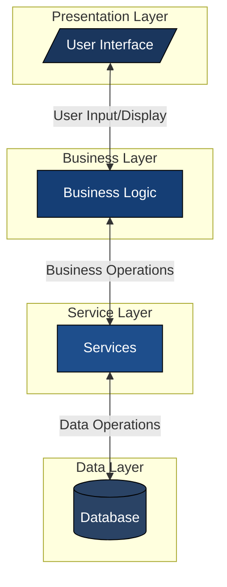

## Event Driven

A pattern where components communicate through events, enabling loose coupling and high scalability. Components can publish and subscribe to events without direct knowledge of each other, making the system highly flexible and adaptable to change.

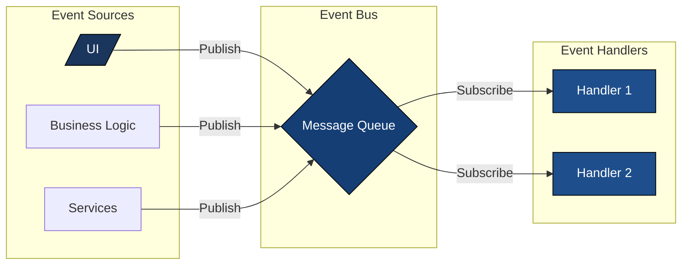

## Microkernel Architecture

A pattern that separates core system functionality from optional plug-in components. The microkernel contains minimal functionality needed to operate the system, while additional features are implemented as plugins, enabling easy system extension and modification.

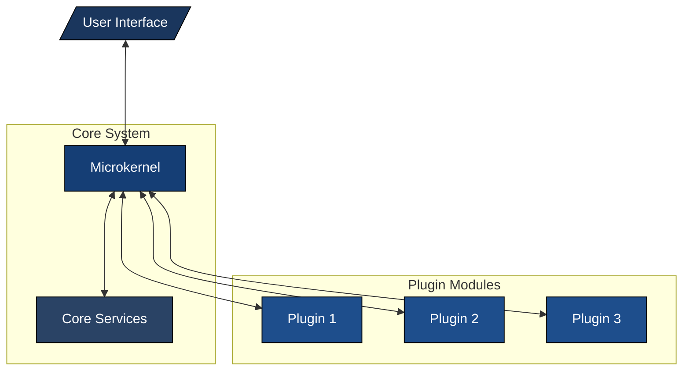

## Microservice Architecture

A distributed architectural style where the application is built as a collection of small, independent services that communicate via APIs. Each service is self-contained, independently deployable, and responsible for specific business capabilities.

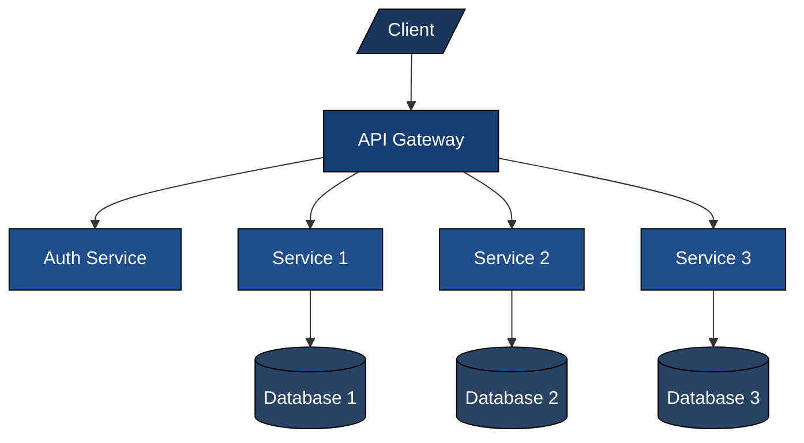

## Shared Storage Architecture

A pattern where multiple application modules share common data storage resources. This approach enables data consistency and reduces redundancy, though careful consideration must be given to concurrency and data access patterns.

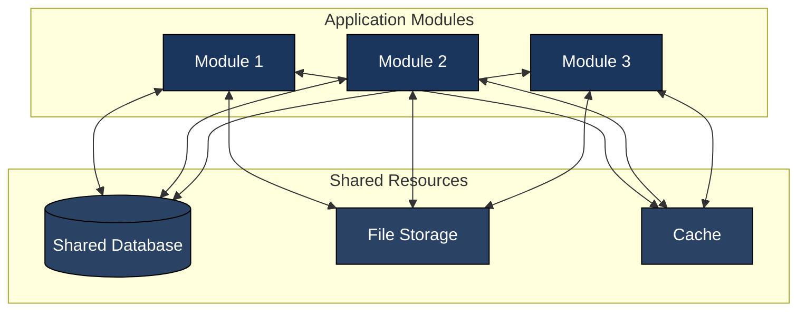

## Primary-Secondary Architecture

A fault-tolerant pattern where one node (primary) handles all write operations while multiple secondary nodes maintain synchronized copies of data. This provides high availability and read scalability while ensuring data consistency.

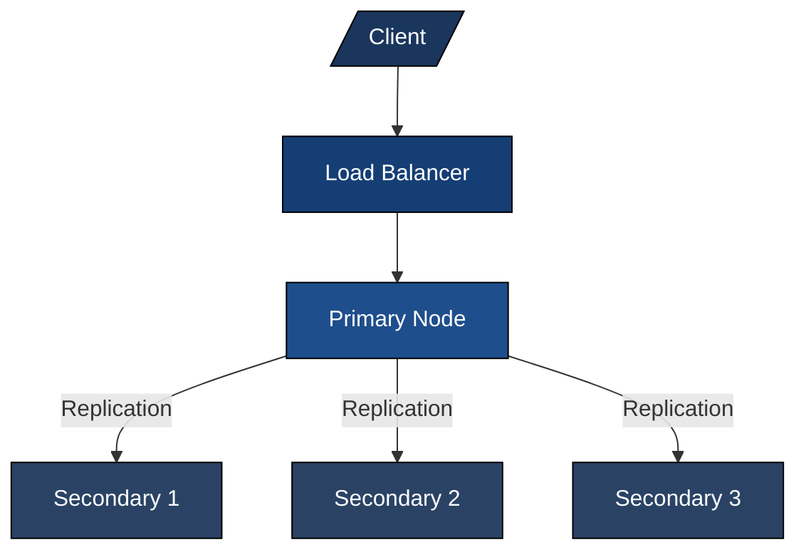

## Pipe-Filter Architecture

A pattern that processes data through a series of independent components (filters) connected by pipes. Each filter performs a specific transformation on the data and passes it to the next filter, enabling modular data processing workflows.

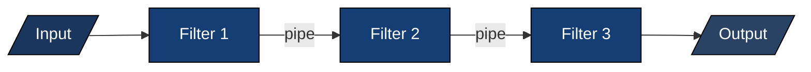

## Message Broker

An architectural pattern that uses an intermediary component to manage and coordinate communication between distributed system components. It enables asynchronous communication and decouples message producers from consumers.

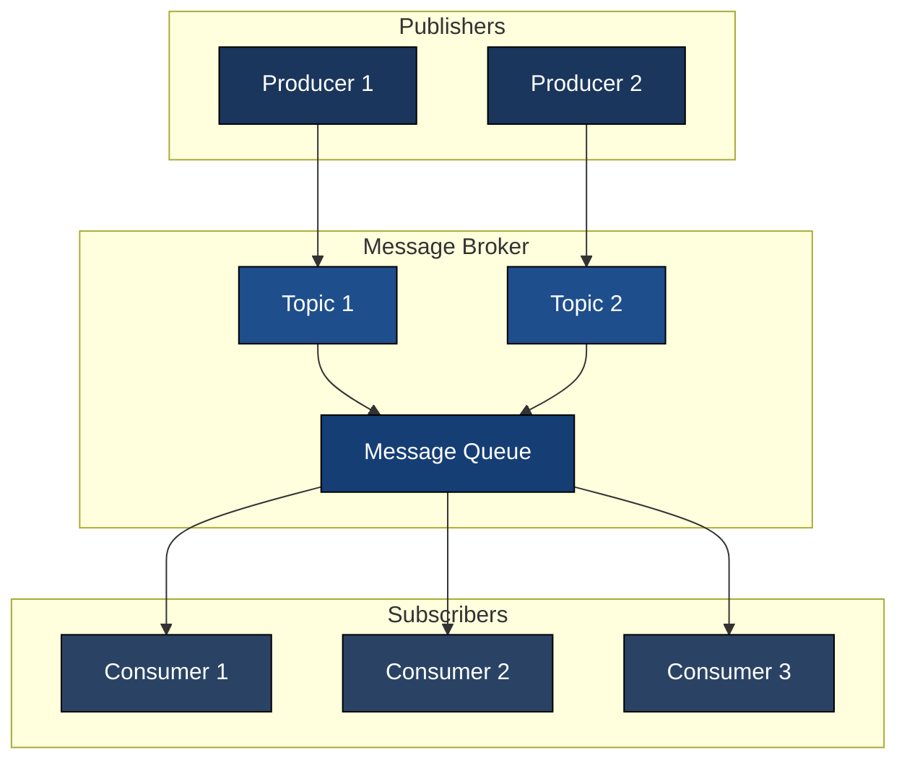

## Peer-to-Peer

A decentralized architecture where nodes (peers) share resources and workload without central coordination. Each peer can act as both client and server, providing high scalability and resilience to failure.

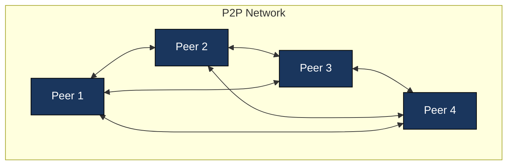

## Layered Architecture

A classic pattern where the system is organized into layers, each with specific responsibilities. Each layer only interacts with the layer directly below or above it, promoting separation of concerns and maintainability.

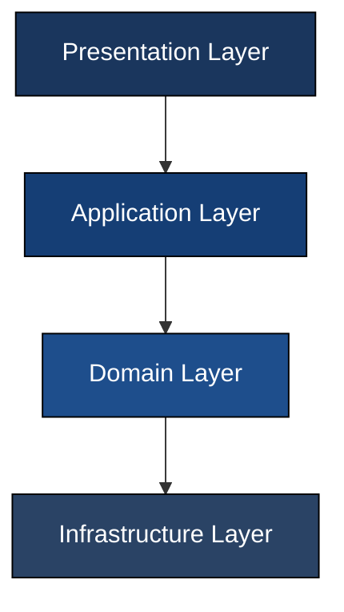

## Space-Based Architecture

A pattern designed for scalability and resilience, where processing units share access to a distributed memory space. This enables dynamic scaling and high availability, especially for systems with variable load.

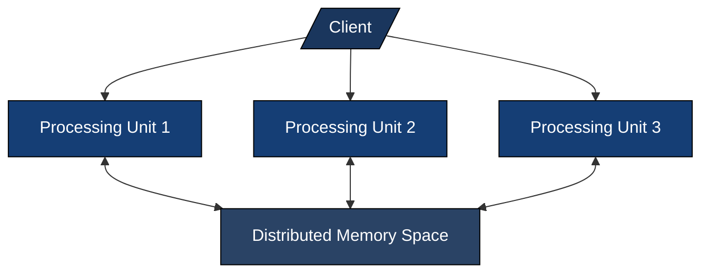

## Broker Architecture

A pattern where a broker component coordinates communication between clients and servers, enabling location transparency and scalability. Common in distributed systems and middleware.

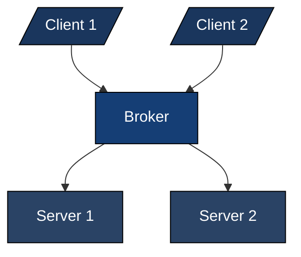
